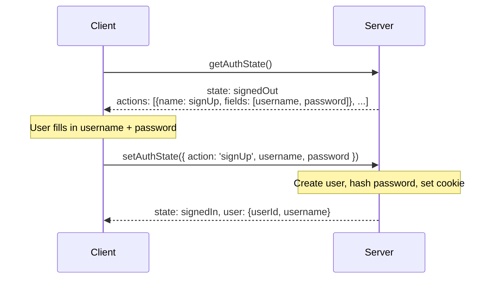
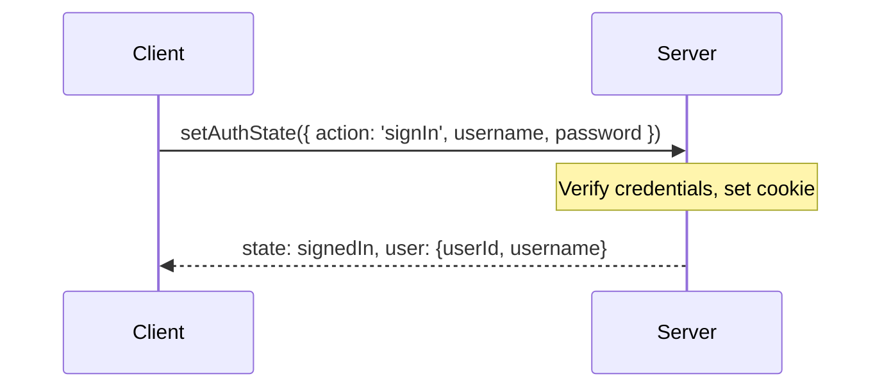
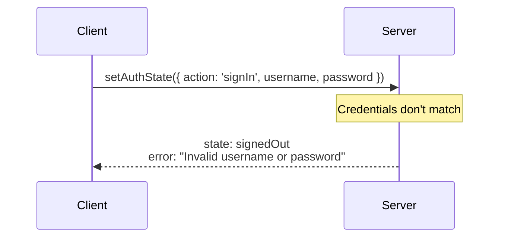
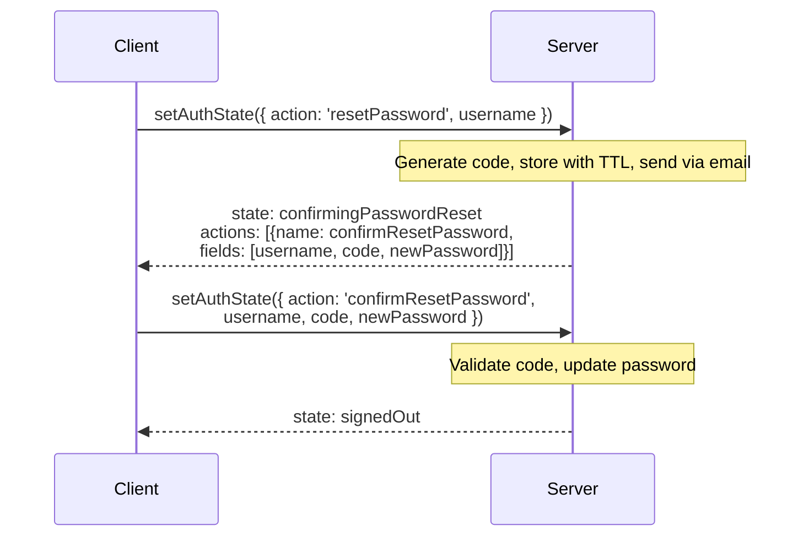
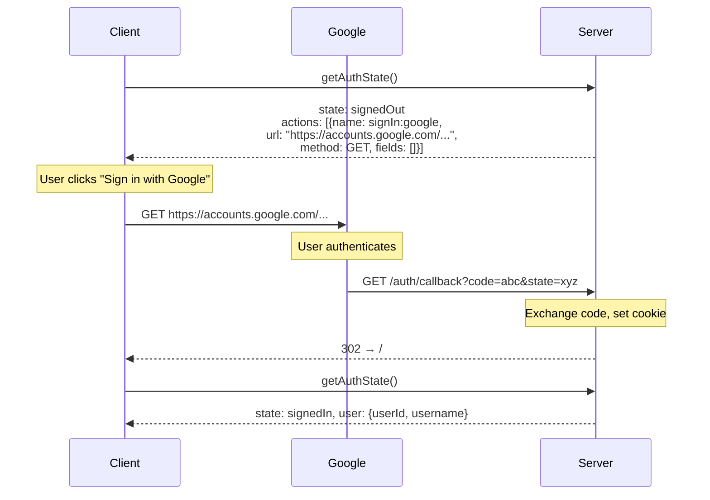
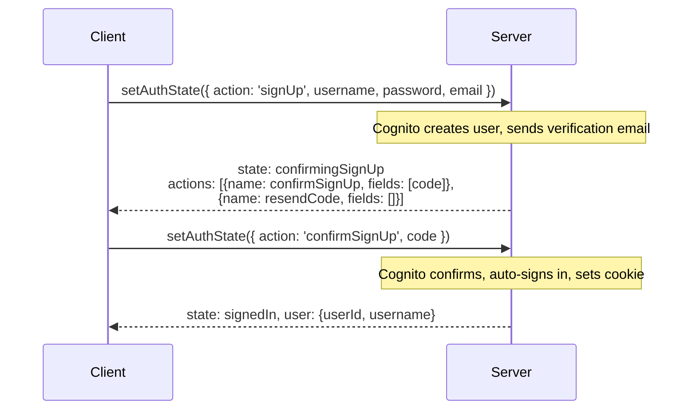
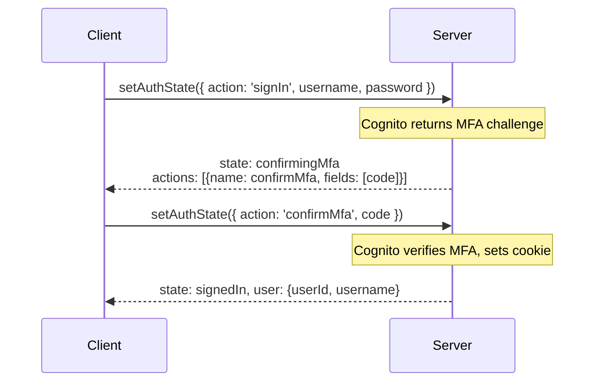
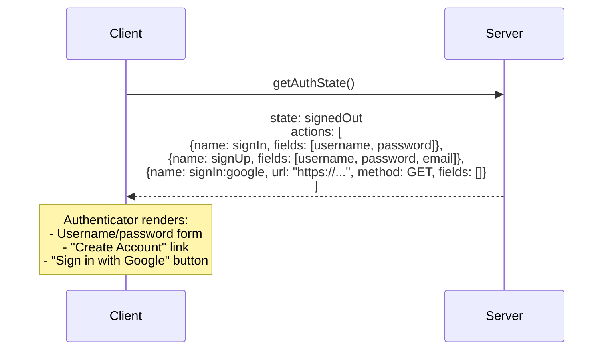

# Auth Common — Design

Design document for the auth common package. For usage, see [README.md](./README.md).

**Package:** `@aws-blocks/auth-common`
**Type:** Shared interface (not a standalone Building Block)
**AWS Service:** None — defines the contract that `AuthBasic`, `AuthOIDC`, and `AuthCognito` implement

## Purpose

All auth Building Blocks should look and work the same from the customer's perspective. This package defines:

1. `BlocksAuth` — server-side interface all auth BBs implement
2. Auth state machine types — drive a provider-agnostic Authenticator component
3. UI components — `Authenticator`, `AuthenticatedContent`, `onAuthChange`, `broadcastAuthChange`

## State Machine Design

Auth is driven by a state machine. The server returns an `AuthState` describing what the client should render and which actions are available. The client renders UI for those actions and submits results back.

Two API methods drive the loop:

- `getAuthState()` — returns the current `AuthState`
- `setAuthState({ action, ...fields })` — submits an action, returns the new `AuthState`

### Unified Form Model

All actions are forms. There is no separate "redirect" action type. Forms differ only in where they submit:

- **Internal forms** (no `url`): client collects field values and calls `setAuthState({ action, ...fields })`
- **External forms** (with `url`): client submits a regular HTML form to that URL via GET or POST

This is a deliberate design choice. OAuth/OIDC sign-in is just a form that submits to an external URL, the same mental model as any other form. The server bakes all OAuth parameters (client_id, scope, state nonce, etc.) into the `url` when constructing the `AuthState`.

### States

States are intentionally minimal — only states where the client must act are represented. Transient server-side states (validating credentials, exchanging tokens) resolve before the response is returned.

| State | Meaning |
|---|---|
| `signedOut` | No session |
| `signedIn` | Authenticated, `user` is present |
| `confirmingSignUp` | Account created, awaiting verification code |
| `confirmingMfa` | Credentials valid, awaiting MFA code |
| `confirmingPasswordReset` | Reset requested, awaiting code + new password |

### Auth Flows

#### AuthBasic: Sign Up

#### AuthBasic: Sign In

#### AuthBasic: Sign In (wrong password)

#### AuthBasic: Password Reset

#### AuthOIDC: Sign In with Google

#### AuthCognito: Sign Up with Email Confirmation

#### AuthCognito: Sign In with MFA

#### AuthCognito: Mixed Form + Federated

## Cross-Tab Auth State Broadcasting

Auth state changes are broadcast via two mechanisms:

1. `BroadcastChannel('blocks-auth')` — delivers to other tabs/windows with the same origin
2. `window.dispatchEvent(new CustomEvent('blocks-auth-change'))` — delivers to the same window (BroadcastChannel only fires on *other* contexts)

The `broadcastAuthChange()` function fires both. All UI components (`Authenticator`, `AuthenticatedContent`, `onAuthChange`) subscribe via `onAuthChange()`, which listens to both channels.

## Cookie Management

All auth BBs manage session cookies via `BlocksContext`:

- **Setting cookies:** After successful authentication, the BB sets an `HttpOnly`, `Secure`, `SameSite=None; Partitioned` cookie on `context.response.headers`
- **Reading cookies:** `requireAuth`/`checkAuth`/`getCurrentUser` read the session cookie from `context.request.headers`
- **Clearing cookies:** `signOut` clears the cookie via `Max-Age=0`

The cookie contains a signed JWT. The BB handles token validation internally — customers never touch tokens directly.
