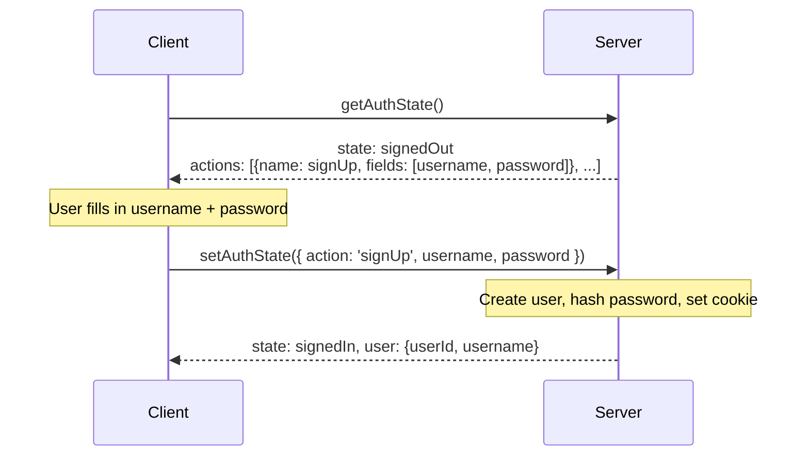
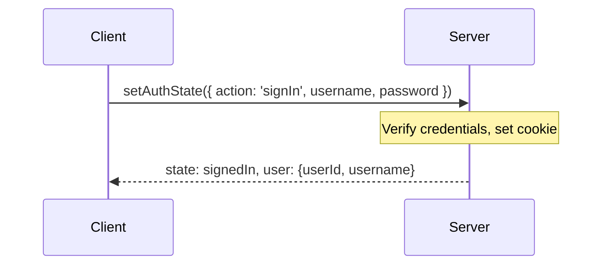
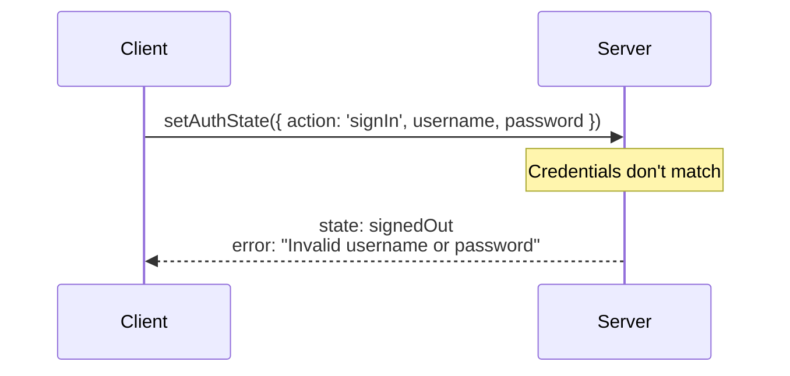
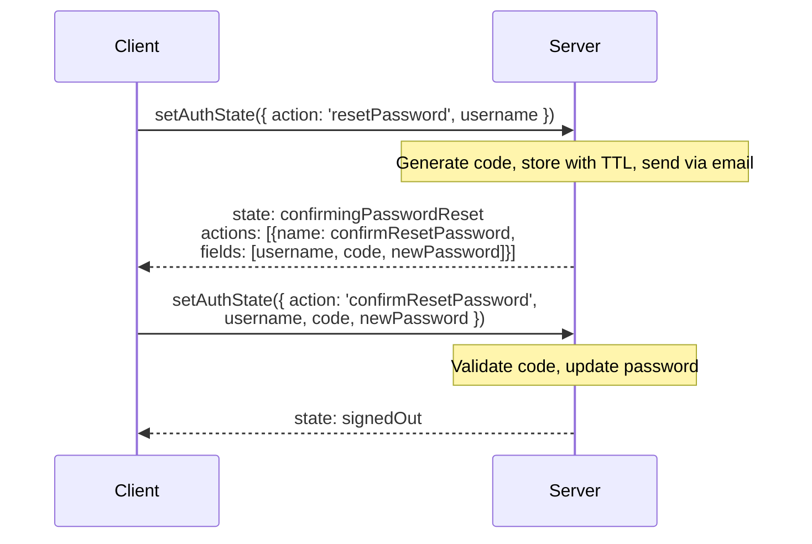
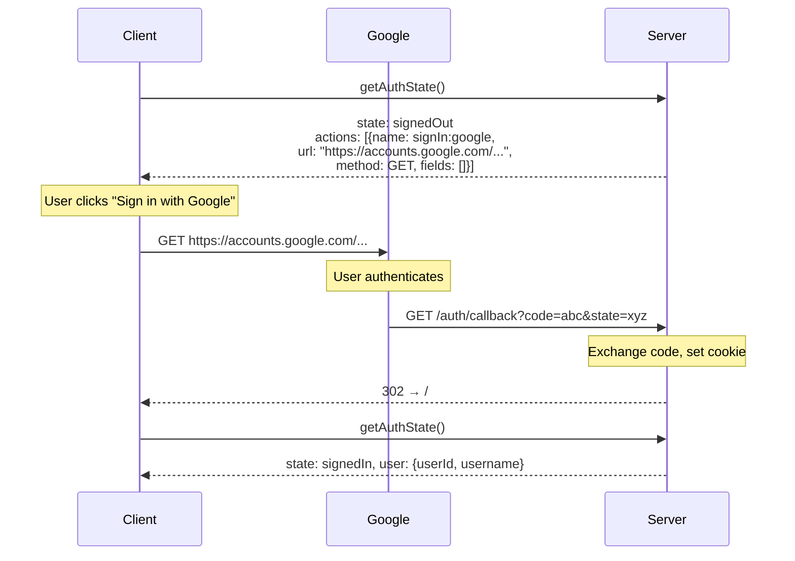
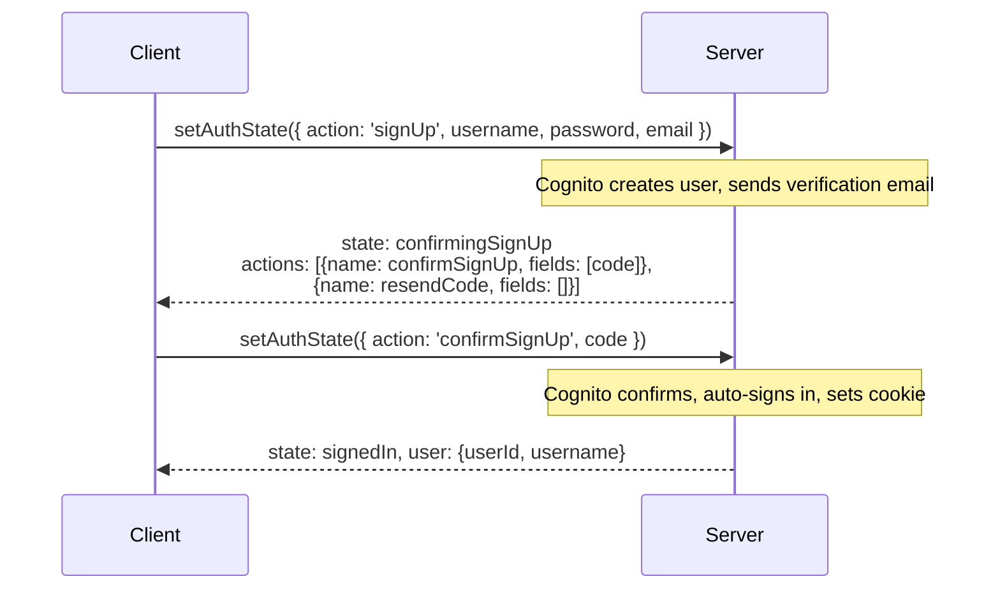
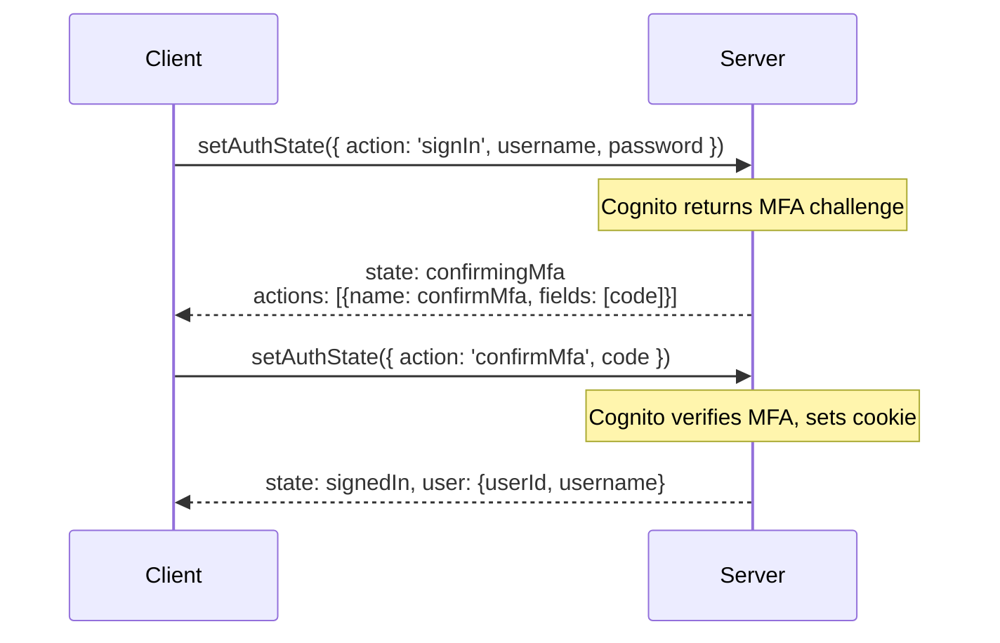
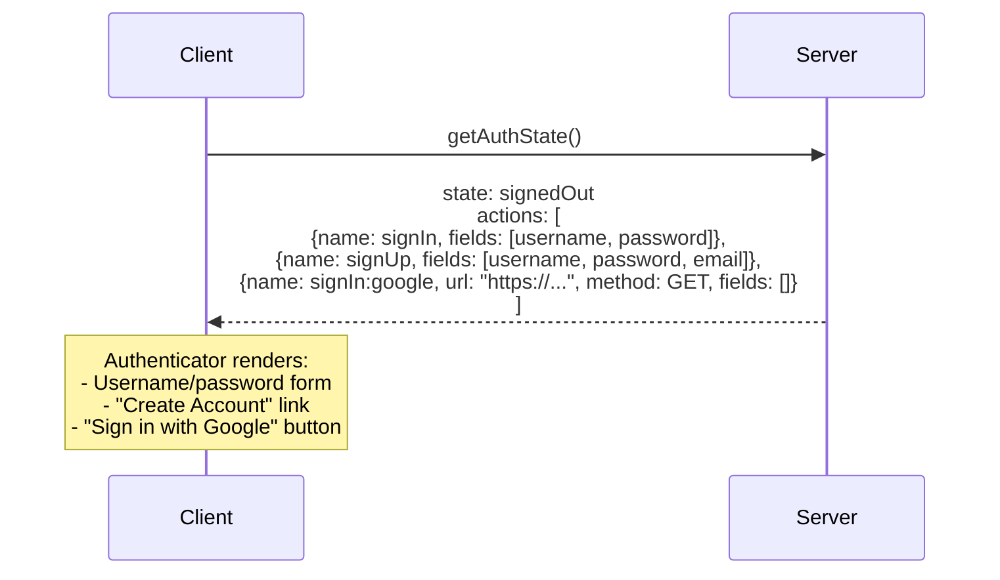

# Auth Common — Design

Design document for the auth common package. For usage, see [README.md](./README.md).

**Package:** `@aws-blocks/auth-common`
**Type:** Shared interface (not a standalone Building Block)
**AWS Service:** None — defines the contract that `Auth` (`@aws-blocks/bb-auth`) implements. It was written for, and implemented by, the three blocks `Auth` replaced: `AuthBasic`, `AuthOIDC` and `AuthCognito`.

## Purpose

All auth Building Blocks should look and work the same from the customer's perspective. This package defines:

1. `BlocksAuth` — server-side interface all auth BBs implement
2. Auth state machine types — drive a provider-agnostic Authenticator component
3. UI components — `Authenticator`, `AuthenticatedContent`, `AccountMenuBar`, `onAuthChange`, `broadcastAuthChange`, plus the client-side notifier `submitAuthAction` and the auth-state store (`subscribeAuthState` / `getAuthStateSnapshot`)
4. `AuthErrors` — the canonical auth error-name vocabulary, plus the `isAuthError` / `isAuthErrorName` guards

## State Machine Design

Auth is driven by a state machine. The server returns an `AuthState` describing what the client should render and which actions are available. The client renders UI for those actions and submits results back.

Two API methods drive the loop:

- `getAuthState()` — returns the current `AuthState`
- `setAuthState({ action, ...fields })` — submits an action, returns the new `AuthState`

### Unified Form Model

All actions are forms. There is no separate "redirect" action type. Forms differ only in where they submit:

- **Internal forms** (no `url`): client collects field values and calls `setAuthState({ action, ...fields })`
- **External forms** (with `url`): client submits a regular HTML form to that URL via GET or POST

This is a deliberate design choice. OAuth/OIDC sign-in is just a form that submits to an external URL, the same mental model as any other form. The server bakes all OAuth parameters (client_id, scope, state nonce, etc.) into the `url` when constructing the `AuthState`.

### States

States are intentionally minimal — only states where the client must act are represented. Transient server-side states (validating credentials, exchanging tokens) resolve before the response is returned.

| State | Meaning |
|---|---|
| `signedOut` | No session |
| `signedIn` | Authenticated, `user` is present |
| `confirmingSignUp` | Account created, awaiting verification code |
| `confirmingMfa` | Credentials valid, awaiting MFA code |
| `confirmingPasswordReset` | Reset requested, awaiting code + new password |

### Auth Flows

These flows were drawn against the three predecessor blocks and still illustrate the state machine. With `Auth`, sign-up always goes through `confirmingSignUp` (the *AuthCognito* flow — *AuthBasic*'s instant sign-up no longer exists), the email + password flows are the *AuthCognito* ones, and a directly federated OIDC provider follows the *AuthOIDC* flow, with its callback at `/aws-blocks/auth/callback`.

#### AuthBasic: Sign Up

```mermaid
sequenceDiagram
	participant C as Client
	participant S as Server

	C->>S: getAuthState()
	S-->>C: state: signedOut<br/>actions: [{name: signUp, fields: [username, password]}, ...]

	Note over C: User fills in username + password

	C->>S: setAuthState({ action: 'signUp', username, password })
	Note over S: Create user, hash password, set cookie
	S-->>C: state: signedIn, user: {userId, username}
```

#### AuthBasic: Sign In

```mermaid
sequenceDiagram
	participant C as Client
	participant S as Server

	C->>S: setAuthState({ action: 'signIn', username, password })
	Note over S: Verify credentials, set cookie
	S-->>C: state: signedIn, user: {userId, username}
```

#### AuthBasic: Sign In (wrong password)

```mermaid
sequenceDiagram
	participant C as Client
	participant S as Server

	C->>S: setAuthState({ action: 'signIn', username, password })
	Note over S: Credentials don't match
	S-->>C: state: signedOut<br/>error: "Invalid username or password"
```

#### AuthBasic: Password Reset

```mermaid
sequenceDiagram
	participant C as Client
	participant S as Server

	C->>S: setAuthState({ action: 'resetPassword', username })
	Note over S: Generate code, store with TTL, send via email
	S-->>C: state: confirmingPasswordReset<br/>actions: [{name: confirmResetPassword,<br/>fields: [username, code, newPassword]}]

	C->>S: setAuthState({ action: 'confirmResetPassword',<br/>username, code, newPassword })
	Note over S: Validate code, update password
	S-->>C: state: signedOut
```

#### AuthOIDC: Sign In with Google

```mermaid
sequenceDiagram
	participant C as Client
	participant G as Google
	participant S as Server

	C->>S: getAuthState()
	S-->>C: state: signedOut<br/>actions: [{name: signIn:google,<br/>url: "https://accounts.google.com/...",<br/>method: GET, fields: []}]

	Note over C: User clicks "Sign in with Google"
	C->>G: GET https://accounts.google.com/...

	Note over G: User authenticates

	G->>S: GET /auth/callback?code=abc&state=xyz
	Note over S: Exchange code, set cookie
	S-->>C: 302 → /

	C->>S: getAuthState()
	S-->>C: state: signedIn, user: {userId, username}
```

#### AuthCognito: Sign Up with Email Confirmation

```mermaid
sequenceDiagram
	participant C as Client
	participant S as Server

	C->>S: setAuthState({ action: 'signUp', username, password, email })
	Note over S: Cognito creates user, sends verification email
	S-->>C: state: confirmingSignUp<br/>actions: [{name: confirmSignUp, fields: [code]},<br/>{name: resendCode, fields: []}]

	C->>S: setAuthState({ action: 'confirmSignUp', code })
	Note over S: Cognito confirms, auto-signs in, sets cookie
	S-->>C: state: signedIn, user: {userId, username}
```

#### AuthCognito: Sign In with MFA

```mermaid
sequenceDiagram
	participant C as Client
	participant S as Server

	C->>S: setAuthState({ action: 'signIn', username, password })
	Note over S: Cognito returns MFA challenge
	S-->>C: state: confirmingMfa<br/>actions: [{name: confirmMfa, fields: [code]}]

	C->>S: setAuthState({ action: 'confirmMfa', code })
	Note over S: Cognito verifies MFA, sets cookie
	S-->>C: state: signedIn, user: {userId, username}
```

#### AuthCognito: Mixed Form + Federated

```mermaid
sequenceDiagram
	participant C as Client
	participant S as Server

	C->>S: getAuthState()
	S-->>C: state: signedOut<br/>actions: [<br/>{name: signIn, fields: [username, password]},<br/>{name: signUp, fields: [username, password, email]},<br/>{name: signIn:google, url: "https://...", method: GET, fields: []}<br/>]

	Note over C: Authenticator renders:<br/>- Username/password form<br/>- "Create Account" link<br/>- "Sign in with Google" button
```

## `BlocksAuth` contract notes

- **Method shorthand, on purpose.** Every member is declared as a method (`requireAuth(context): …`), never as a property holding a function type. Under `strictFunctionTypes`, property-style function types check parameters contravariantly, while methods are checked bivariantly. Implementations narrow parameters (e.g. `Auth.requireRole` accepts only its declared group names, as `AuthCognito.requireRole` did), and only method shorthand lets those implementations satisfy the interface. `src/blocks-auth.types-test.ts` pins both the passing case and the property-syntax counterexample.
- **`requireRole` is required.** `Auth` implements it. It was optional while two of the blocks `Auth` replaced (`AuthBasic`, `AuthOIDC`) existed, because they had no roles; it became a required member when they were removed.
- **The 401 name is `NotAuthenticatedException`.** `Auth` throws it from `requireAuth`, as `AuthCognito` and `AuthOIDC` did (the removed `AuthBasic` threw `SessionExpiredException`).

## Auth error vocabulary

`AuthErrors` (`src/errors.ts`) is the one set of error names the `Auth` block throws. Names follow Amazon Cognito's exception names wherever Cognito has one; the federation-flow names keep the same `*Exception` suffix. Matching is by `name` (`isAuthError` / `isBlocksError` on a thrown error, `hasAuthError` on a returned `AuthState`), which works the same on server and client.

Adding `AuthErrors` changed nothing about what the predecessor blocks threw. There are **no runtime aliases**: a caller matching an old `AuthBasic` name will not match the new one, so each rename below is a breaking change when `AuthBasic` callers move to `Auth` (see [`MIGRATION.md`](../bb-auth/MIGRATION.md#error-names)).

### Mapping from today's names

`src/errors.test.ts` holds this table as data and fails when any of the three auth BBs' sources contain an error name with no row, so the table cannot fall behind.

| Source | Today's name | `AuthErrors` | Change |
|---|---|---|---|
| `AuthCognito` | all 29 `AuthCognitoErrors` | same keys, same values | unchanged |
| `AuthOIDC` | all 8 `AuthOIDCErrors` | same keys, same values | unchanged |
| `AuthBasic` | `InvalidPassword` → `InvalidPasswordException` | `InvalidPassword` | unchanged |
| `AuthBasic` | `InvalidCredentials` → `InvalidCredentialsException` | `NotAuthorized` → `NotAuthorizedException` | renamed |
| `AuthBasic` | `UserAlreadyExists` → `UserAlreadyExistsException` | `UserAlreadyExists` → `UsernameExistsException` | renamed (key kept, value changes) |
| `AuthBasic` | `SessionExpired` → `SessionExpiredException` | `NotAuthenticated` → `NotAuthenticatedException` | renamed |
| `AuthBasic` | `InvalidCode` → `InvalidCodeException` | `CodeMismatch` **and** `ExpiredCode` | **split** — wrong code vs. expired / no outstanding code. Every `isBlocksError` / `hasAuthError` call site matching `InvalidCode` needs a manual decision; there is no mechanical rename. |
| `AuthOIDC` | `AuthOIDCEngineError` (plain `Error`, Cognito-federation engine) | `ProviderNotConfigured`, `InvalidState`, `InvalidCallback`, `IdpError`, `TokenExpired` | **split** — by failure: provider not configured; pending cookie / state mismatch; missing code; token exchange failed; refresh failed |
| `AuthOIDC` | `AuthOIDCConfigError`, `RelayConfigError` (plain `Error`) | — | excluded: constructor-time configuration mistakes stay plain `Error`s with no constant ([D-AB-10](https://github.com/aws-devtools-labs/aws-blocks/blob/b58f248706bba1cfd3a73308dddb92a5733f6da8/packages/bb-auth-basic/DESIGN.md#d-ab-10-named-error-constants-only-for-user-facing-input-errors), in the removed `bb-auth-basic`) |
| `AuthOIDC` | `ResourceNotFoundException`, `DuplicateProviderException` | — | excluded: Cognito SDK errors caught inside the IdP-registration custom-resource Lambda, never surfaced |
| `AuthCognito` | `AccessDeniedException`, `UnrecognizedClientException`, `InvalidSignatureException`, `ExpiredTokenException`, `CredentialsProviderError` | — | excluded: AWS rejected the function role's own credentials or IAM policy, which is a deployment problem and not an auth outcome. Reported by name as a 500 with a generic message; the detail (role ARN, account id) is logged, never sent to the client |

New names with no predecessor: `ReauthenticationRequired`, `ProviderMisconfigured`, `EmailPasswordNotEnabled`, `NoFederatedProvider`.

`AuthCognito` also passed any other Cognito exception through by its service name (e.g. `CodeDeliveryFailureException`); those are not part of the vocabulary, and `Auth` reports them as `InternalErrorException`.

## Cross-Tab Auth State Broadcasting

Auth state changes are broadcast via two mechanisms:

1. `BroadcastChannel('blocks-auth')` — delivers to other tabs/windows with the same origin
2. `window.dispatchEvent(new CustomEvent('blocks-auth-change'))` — delivers to the same window (BroadcastChannel only fires on *other* contexts)

The `broadcastAuthChange()` function fires both. `onAuthChange()` listens to both, and `AuthenticatedContent` and `AccountMenuBar` render through it. The channel name, the event name and the `{ type: 'auth-change', user }` payload are a wire format: tabs running an older and a newer bundle coexist during a deploy, so none of them may be renamed.

### One notifier, two views

`setAuthState()` is a plain RPC. It runs in Node too (SSR, cookie-jar scripts, e2e clients), so it never touches the client state. `submitAuthAction(api, input)` is the single client-side notifier, and every built-in submit path goes through it (the `Authenticator` form and Enter key, the slot `submit` helper, the auto sign-in chain, `AccountMenuBar`'s Sign Out). It:

1. calls `setAuthState(input)` once and returns its result unchanged;
2. on `retriable: true`, stops there — the caller keeps the current form and its hidden fields;
3. otherwise writes the per-`api` store (a `WeakMap` keyed by the `api` object's identity);
4. and broadcasts `user ?? null` when the resulting state is `signedIn` or `signedOut`. The trigger is the resulting state, not a diff, so a tab that missed a broadcast still converges. Mid-flow challenge states are not broadcast.

Outside a browser it is just the RPC: a module-level store keyed by a shared server-side `authApi` would leak one request's state into another.

That gives two views of one source:

| View | API | Fires on |
|---|---|---|
| User-level | `onAuthChange` | sign-in / sign-out broadcasts (this window and other tabs), plus its synchronous first frame and hydration |
| State-level | `subscribeAuthState` / `getAuthStateSnapshot` | every store write: hydration, every non-retriable `submitAuthAction` result including mid-flow states, and a cross-tab refetch |

The store's only inputs are hydration (one shared in-flight `getAuthState()` per `api`), `submitAuthAction`, and a cross-tab refetch: a broadcast from another tab triggers one `getAuthState()` per `api` that has store subscribers (the `Authenticator` is one), installed with the first subscriber and removed with the last. A same-window broadcast is not refetched, because `submitAuthAction` already wrote the store. The snapshot keeps its identity between writes, as `useSyncExternalStore` requires.

## Cookie Management

All auth BBs manage session cookies via `BlocksContext`:

- **Setting cookies:** By default the BB sets an `HttpOnly`, `SameSite=Lax` cookie (`Secure` in production) on `context.response.headers` after successful authentication. When `crossDomain: true`, it switches to `SameSite=None; Secure; Partitioned`. See [D-007](../../docs/DECISIONS.md#d-007-auth-cookies-default-to-samesitelax-cross-domain-is-opt-in).
- **Reading cookies:** `requireAuth`/`checkAuth`/`getCurrentUser` read the session cookie from `context.request.headers`
- **Clearing cookies:** `signOut` clears the cookie via `Max-Age=0`

The cookie contains a signed JWT. The BB handles token validation internally — customers never touch tokens directly.
